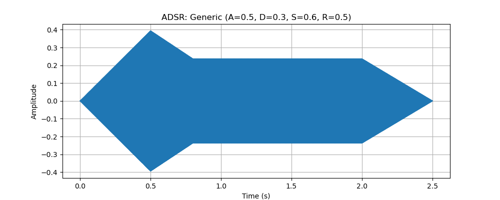
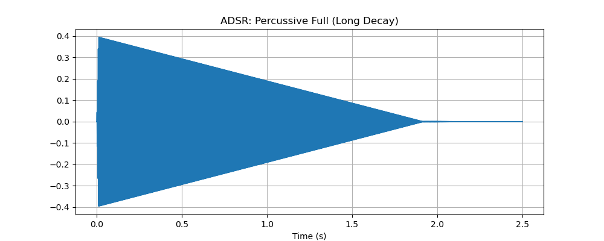
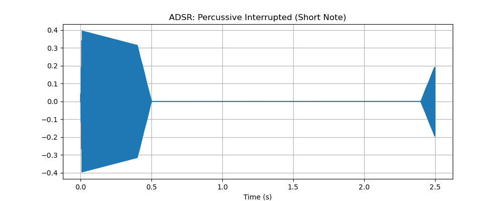
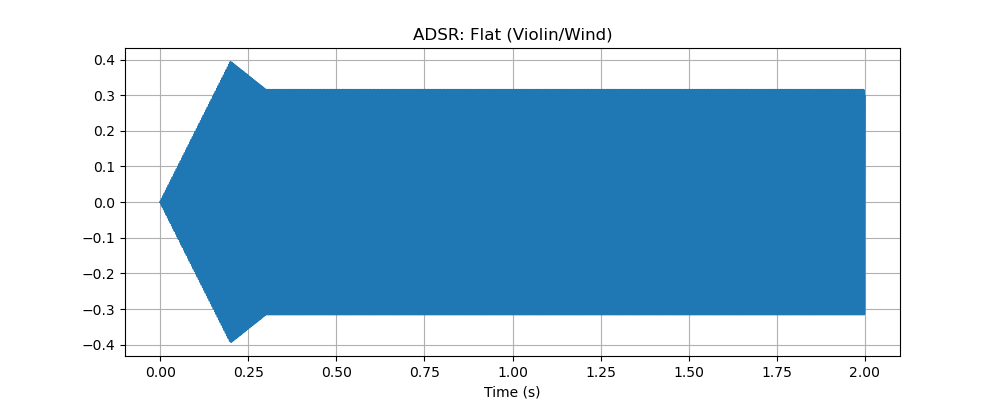
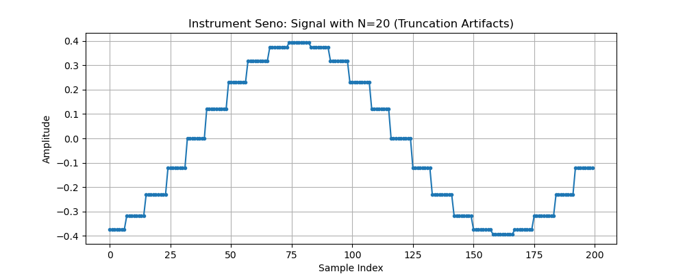
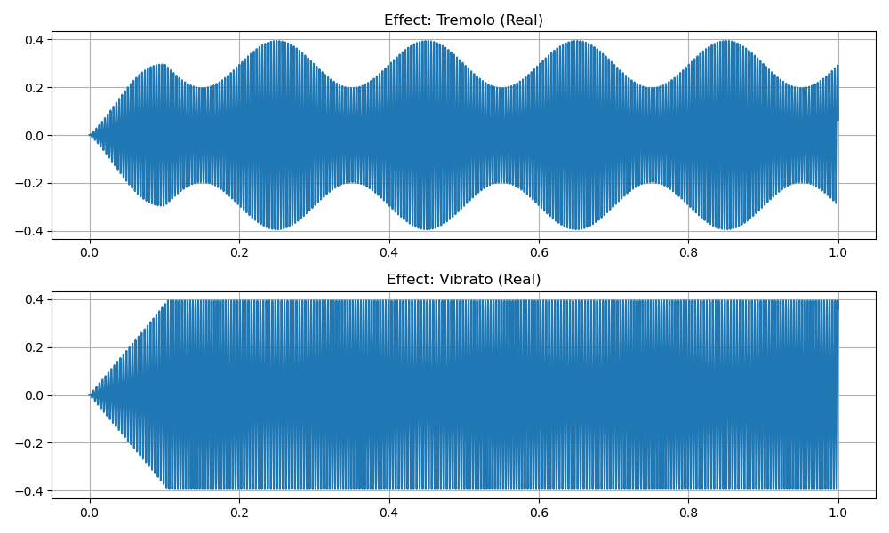
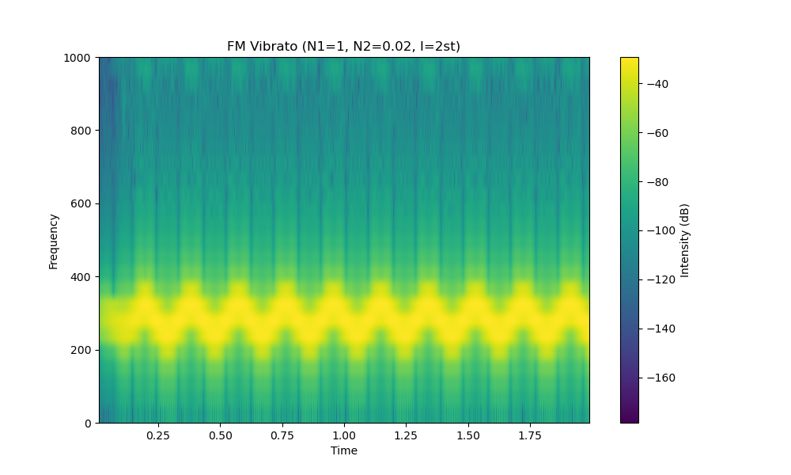
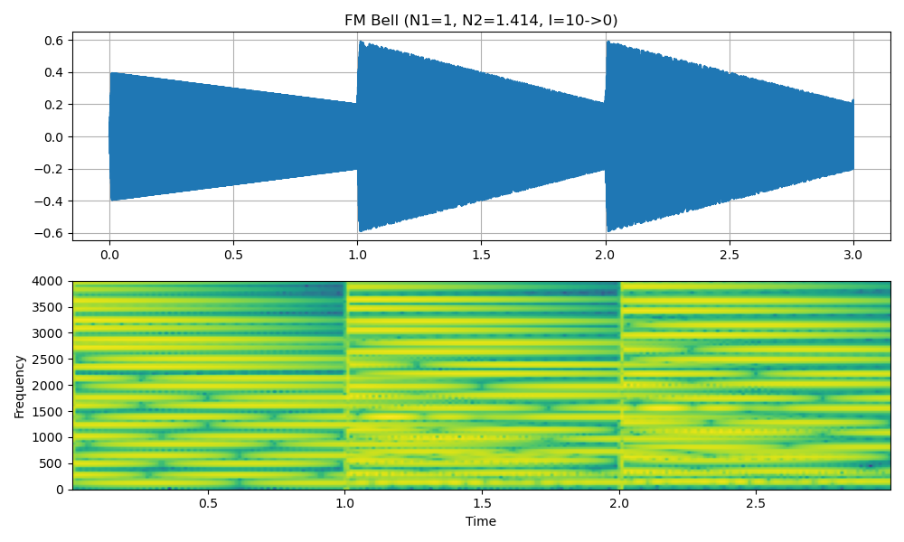

# PAV - P5: Síntesis musical polifónica

Obtenga su copia del repositorio de la práctica accediendo a [Práctica 5](https://github.com/albino-pav/P5) y pulsando sobre el botón Fork situado en la esquina superior derecha. A continuación, siga las instrucciones de la [Práctica 2](https://github.com/albino-pav/P2) para crear una rama con el apellido de los integrantes del grupo de prácticas, dar de alta al resto de integrantes como colaboradores del proyecto y crear la copias locales del repositorio.

Como entrega deberá realizar un pull request con el contenido de su copia del repositorio. Recuerde que los ficheros entregados deberán estar en condiciones de ser ejecutados con sólo ejecutar:

```bash
make release
```

A modo de memoria de la práctica, complete, en este mismo documento y usando el formato markdown, los ejercicios indicados.

## Ejercicios

### Envolvente ADSR

Tomando como modelo un instrumento sencillo (puede usar el `InstrumentDumb`), genere cuatro instrumentos que permitan visualizar el funcionamiento de la curva ADSR.

Para visualizar correctamente las distintas configuraciones de la envolvente ADSR, se han generado las siguientes gráficas:

1.  **Envolvente ADSR genérica**: Se aprecian claramente las cuatro fases: Ataque (A), Decaimiento (D), Mantenimiento (S) y Liberación (R).
    

2.  **Instrumento percusivo (Extinción completa)**: Ataque muy rápido, sin sostenimiento (Sustain=0) y decaimiento lento. En este caso, la nota se deja sonar hasta que se extingue naturalmente.
    

3.  **Instrumento percusivo (Interrumpido)**: Similar al anterior, pero el intérprete finaliza la nota (`NoteOff`) antes de la extinción completa. Se observa cómo entra la fase de Release, cortando el sonido abruptamente.
    

4.  **Instrumento plano**: Tipo violín o instrumento de viento. Ataque suave pero rápido hasta el nivel de sostenimiento, que se mantiene constante hasta una liberación también relativamente rápida.
    

### Instrumentos Dumb y Seno

Implemente el instrumento Seno tomando como modelo el `InstrumentDumb`. La señal deberá formarse mediante búsqueda de los valores en una tabla.

A continuación se muestra el código implementado para la síntesis:

```cpp
const std::vector<float> & InstrumentSeno::synthesize() {
  if (not adsr.active()) {
    x.assign(x.size(), 0);
    bActive = false;
    return x;
  }
  else if (not bActive)
    return x;

  for (unsigned int i=0; i<x.size(); ++i) {
    // Truncamiento: Tomamos la parte entera de la fase para el índice
    int index = (int) phase;
    x[i] = A * tbl[index];
    phase += incPhase;
    while (phase >= tbl.size())
      phase -= tbl.size();
  }
  adsr(x); // Aplicar envolvente

  return x;
}

void InstrumentSeno::command(long cmd, long note, long vel) {
  if (cmd == 9) { // Note ON
    bActive = true;
    adsr.start();
    this->phase = 0;
    float f0 = 440 * pow(2, (note - 69.0) / 12.0);
    this->incPhase = 2 * M_PI * f0 / SamplingRate * tbl.size();
    A = vel / 127.0;
  }
  else if (cmd == 8) { // Note OFF
    adsr.stop();
  }
  else if (cmd == 0) { // Finalización inmediata
    adsr.end();
  }
}
```

**Método de interpolación**: Se ha utilizado el método de **truncamiento** (interpolación de orden 0). El índice de lectura de la tabla se obtiene tomando la parte entera de la fase acumulada (`(int) phase`). Si bien es el método más eficiente computacionalmente, introduce ruido de cuantificación en forma de "escalones" si la tabla no tiene suficiente resolución, como se aprecia en la siguiente imagen (los puntos son los valores de la tabla, la línea la señal reconstruida):



### Sistema Modular de Wavetables (WTB)

El proyecto utiliza un sistema modular para la gestión de tablas de ondas (wavetables), centrado en la clase `WavetableLoader` y su interacción con los instrumentos.

**Funcionamiento**:
1.  **Singleton & Caché**: La clase `WavetableLoader` implementa el patrón Singleton. Mantiene un mapa (`cache`) que asocia nombres de archivo con vectores de datos (`std::vector<float>`).
2.  **Eficiencia**: Cuando un instrumento solicita cargar un fichero (ej. `sine.wtb`), el Loader verifica si ya está en memoria. Si lo está, devuelve un puntero a los datos existentes. Esto permite que múltiples instancias de `InstrumentSeno`, `InstrumentWavetable` o `InstrumentFM` compartan la misma tabla en memoria sin duplicar datos, optimizando el uso de RAM.
3.  **Interacción con FM y Efectos**:
    *   **FM**: El `InstrumentFM` utiliza este sistema para cargar la forma de onda portadora y moduladora (por defecto senoidales, pero configurables vía el parámetro `file`). Esto permite síntesis FM avanzada con formas de onda arbitrarias (ej. modular una onda cuadrada con un triángulo).
    *   **Efectos**: Los efectos como `Tremolo` y `Vibrato` operan sobre el buffer de salida generado por el instrumento. Gracias a la abstracción de `Instrument`, los efectos son agnósticos a si la señal provino de una síntesis aditiva, FM o de una Wavetable cargada por el sistema modular.

### Efectos sonoros

Incluya dos gráficas en las que se vean, claramente, el efecto del trémolo y el vibrato sobre una señal sinusoidal.



**Explicación**:
*   **Trémolo (Izquierda)**: Es una Modulación de Amplitud (AM). Una señal de baja frecuencia (LFO) modula el volumen de la señal original. Se observa cómo la envolvente de la señal oscila.
    *   Implementación: `x[i] *= ((2 - A) + A * sin(fase)) / 2;` donde $A$ controla la profundidad.
*   **Vibrato (Derecha)**: Es una Modulación de Frecuencia (FM) o de fase. Se percibe como una oscilación en la altura (tono) de la nota.
    *   Implementación: Se usa un buffer circular con un retardo variable. El retardo oscila sinusoidalmente controlado por el índice $I$ (profundidad en semitonos) y $f_m$ (velocidad).
    *   Espectrograma del Vibrato: Se aprecia claramente la oscilación de la frecuencia fundamental y los armónicos.
    

Para generar el audio de los efectos:
```bash
synth work/tests/effects.orc work/tests/effects.sco work/tests/effects.wav
```

### Síntesis FM

Construya un instrumento de síntesis FM.

**Correspondencia de parámetros**:
El instrumento FM implementado permite definir:
*   $N_1$: Factor de frecuencia de la portadora.
*   $N_2$: Factor de frecuencia de la moduladora.
*   $I$: Índice de modulación (puede definirse en semitonos para mayor musicalidad).

La relación básica es: $x(t) = A(t) \cdot \sin(2\pi f_c t + I(t) \cdot \sin(2\pi f_m t))$.

**Instrumentos Generados**:
1.  **Campana**: Se caracteriza por armónicos inarmónicos (no enteros).
    *   Parámetros: $N_1=1$, $N_2=1.414$ ($\approx\sqrt{2}$), $I=10$ (con decaimiento exponencial).
    *   Gráfica de la señal: Se observa la forma de onda compleja y la evolución de la amplitud.
    

2.  **Clarinete**:
    *   Parámetros: $N_1=3$, $N_2=2$, $I=2$ (escalado). Esto genera armónicos impares predominantes, típicos de un tubo cerrado por un extremo.

Orden para generar la escala con estos sonidos:
```bash
synth work/tests/fm_instruments.orc work/doremi.sco work/doremi/fm_scale.wav
```

### Orquestación usando el programa synth

Use el programa synth para generar canciones a partir de su partitura MIDI.

**Toy Story - You've got a friend in me**:
Se ha orquestado esta pieza utilizando instrumentos básicos (Seno para la melodía y Pulso/Dumb para el bajo) definidos en `work/multi.orc`.

Orden de generación:
```bash
synth work/multi.orc samples/ToyStory_A_Friend_in_me.sco work/music/toystory.wav
```

**Hawaii 5-0**:
Orden de generación:
```bash
synth work/multi.orc samples/Hawaii5-0.sco work/music/hawaii.wav
```

**Happy Xmas (War Is Over)**:
Orden de generación:
```bash
synth work/multi.orc samples/The_Christmas_Song_Lennon.sco work/music/happy_xmas.wav
```
